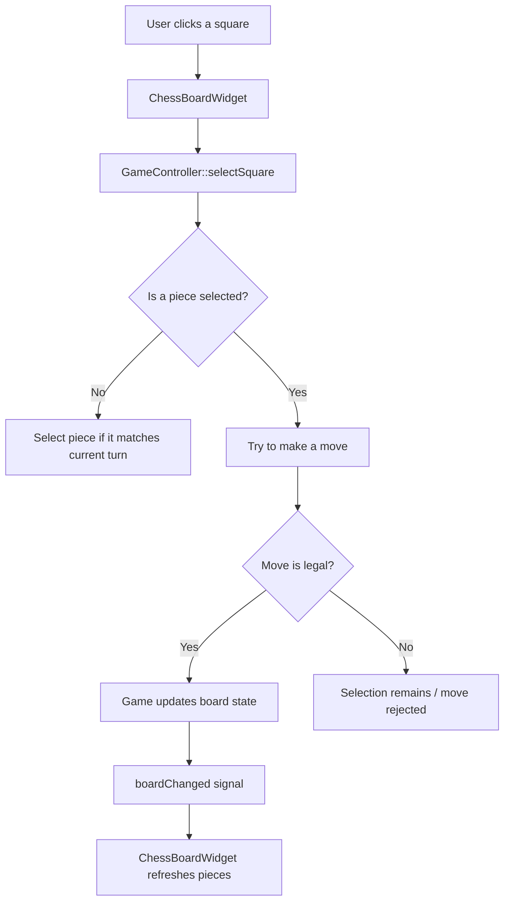
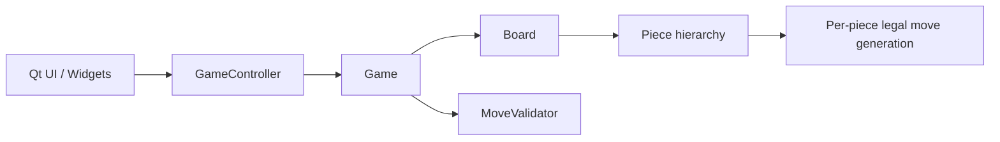
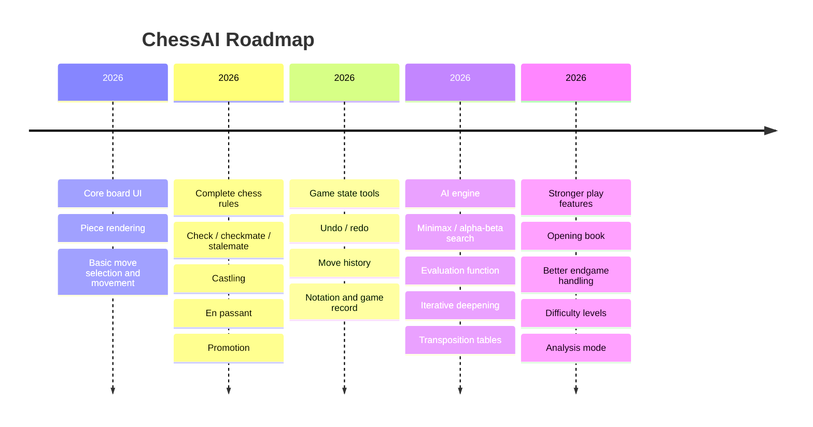

# ChessAI


A Qt-based chess application that is being built toward a full-fledged chess AI.

The current program already provides a playable chess board with a graphical interface, piece rendering, turn handling, and basic move selection / execution. The long-term goal is to grow this into a complete chess engine with strong search, evaluation, and AI-driven gameplay.

---

## Current state

What is implemented right now:

- Qt desktop UI with a board rendered through `QGraphicsView`
- SVG chess board and piece assets
- Initial chess setup for both sides
- Click-to-select and click-to-move interaction
- Basic legal move generation for standard pieces
- Turn tracking between White and Black
- Board refresh after a successful move
- Project configured with CMake and Qt6

What is **not** implemented yet:

- AI opponent / engine search
- Undo / redo history wiring
- Check, checkmate, stalemate detection
- Castling
- En passant
- Pawn promotion UI
- Move notation / game record export
- Position evaluation / opening book / endgame tablebases

---

## How it works

The app is structured around a simple flow:



### High-level architecture



---

## Controls

- **Left click a piece** to select it
- **Left click a destination square** to attempt the move
- Clicking the selected square again clears selection

> Moves are validated by the current game rules before they are applied.

---

## Project layout

```text
Chess/
├── assets/          # SVG board and piece artwork
├── include/         # Public headers
├── resources/       # Qt resource file
├── src/             # Application source
├── docs/            # Diagrams and supporting docs
├── CMakeLists.txt   # Build configuration
└── README.md
```

---

## Building

### Requirements

- CMake 3.21 or newer
- C++20-capable compiler
- Qt 6 modules:
  - `Core`
  - `Gui`
  - `Widgets`
  - `Svg`
  - `SvgWidgets`

### Configure and build

```bash
cmake -S . -B build
cmake --build build
```

If you use an IDE with CMake integration, opening the project root should be enough.

---

## Implementation notes

The current code is organized into a few clear layers:

- `game/` contains board state, move representation, and move validation
- `game/pieces/` contains per-piece movement logic
- `controller/` translates UI events into game actions
- `widgets/` renders the board and pieces
- `ui/` hosts the main window

This layout is intended to make the engine easier to extend later when the AI layer is added.

---

## Roadmap

The long-term plan is to evolve this into a complete chess AI application.



### Planned engine work

- Legal position validation beyond basic piece movement
- Check-aware move generation
- Search-based engine with alpha-beta pruning
- Position evaluation heuristics
- Iterative deepening and time management
- Transposition tables for repeated positions
- Optional opening and endgame support

### Planned UI work

- Move highlighting
- Captured piece display
- Promotion dialog
- Game state indicators
- Undo / redo controls
- Engine-vs-player and engine-vs-engine modes

---

## Why this project exists

This codebase is being built with a clean separation between UI, rules, and future AI logic so the chess engine can grow without the interface becoming tangled with search or evaluation details.

That should make it easier to iterate from a simple playable chess board into a serious chess AI over time.

---

## License

No license has been added yet.
